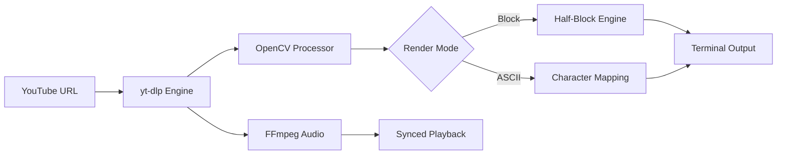

<div align="center">

# 🎬 TUBE-ASCII PLAYER


[](https://www.python.org/)
[](https://opensource.org/licenses/MIT)
[](https://github.com/idusha-manaka/TubeASCII/stargazers)
[](https://github.com/idusha-manaka/TubeASCII)

---

### 🌐 **Stream Anything. Anywhere. In ASCII.**
*Breaking the boundaries between the command line and high-definition video.*

[✨ Features](#-key-features) • [🚀 Setup](#-quick-setup) • [🎮 Controls](#-battle-stations) • [🛠️ Architecture](#-how-it-works)

</div>

---

## ⚡ Visual Pipeline


---

## 💎 Key Features

<div align="center">

| 🎨 **Rendering Engine** | 🚀 **Performance** | 🔊 **Audio & Sync** |
| :--- | :--- | :--- |
| **Block Mode (`▀`)**<br>Ultra-accurate color reproduction using Unicode magic. | **Real-time Streaming**<br>Powered by `yt-dlp` for lag-free direct playback. | **Surround Feel**<br>Synced background audio via `ffplay` integration. |
| **ASCII Detailed**<br>High-density character mapping for retro vibes. | **Dynamic Scaling**<br>Intelligent frame resizing to fit any terminal width. | **Manual Offset**<br>Fine-tune audio/video sync on the fly with `[` and `]`. |

</div>

---

## 🚀 Quick Setup

### 📦 Installation
```bash
# Clone the repository
git clone https://github.com/idusha-manaka/TubeASCII.git
cd TubeASCII

# Install the power-ups
pip install -r requirements.txt
```

### 🎧 The Pilot (FFmpeg)
Ensure `ffmpeg.exe` and `ffplay.exe` are in the folder or your system `PATH`. This is the heartbeat of your audio experience.

### 🎬 Start Streaming
```bash
python main.py
```

---

## 🎮 Battle Stations: Controls

| Command | Hotkey | Effect |
| :--- | :---: | :--- |
| **Play / Pause** | <kbd>Space</kbd> | Freeze time or resume the flow |
| **Turbo Mode** | <kbd>→</kbd> | Increase playback speed (+0.25x) |
| **Slow Motion** | <kbd>←</kbd> | Decrease playback speed (-0.25x) |
| **Sync Adjust** | <kbd>[</kbd> <kbd>]</kbd> | Perfect your A/V alignment (±0.1s) |
| **Abort Mission** | <kbd>Q</kbd> | Terminate player and return to terminal |

---

## 🛠️ The Tech Behind the Magic

<p align="center">
  
  
  
  
</p>

---

## 📈 Project Status


---

<div align="center">

### 🌟 Show Your Support
Give this project a star if it made your terminal feel like a cyberpunk workspace!

<a href="https://github.com/idusha-manaka/TubeASCII/stargazers">
  
</a>

<br><br>

**Crafted with 💖 by [Idusha Manaka](https://github.com/idusha-manaka)**

[](https://github.com/idusha-manaka)

</div>
