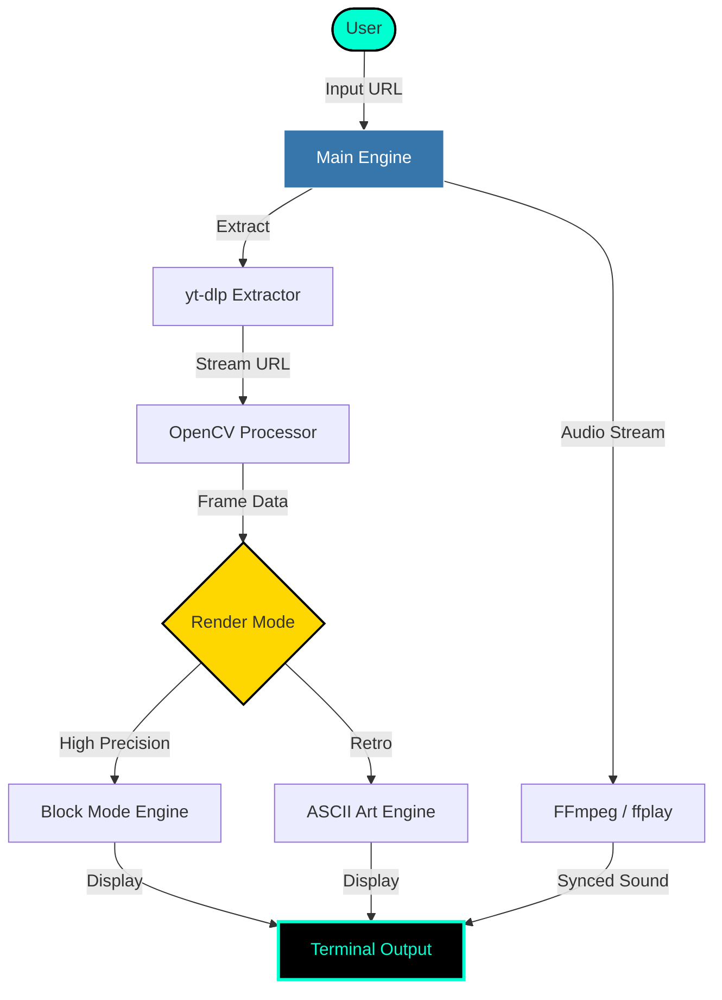

# 🎬 TUBE-ASCII PLAYER

<p align="center">
  
</p>

<p align="center">
  <a href="https://github.com/idusha-manaka/TubeASCII/stargazers"></a>
  <a href="https://www.python.org/"></a>
  <a href="https://opensource.org/licenses/MIT"></a>
  
</p>

<p align="center">
  
  
  
</p>

---

<p align="center">
  <b>Transform your terminal into a high-definition ASCII cinema.</b><br>
  <i>No browsers. No bloat. Just pure, unadulterated command-line streaming.</i>
</p>

<p align="center">
  <a href="#-key-features"><b>Features</b></a> • 
  <a href="#-setup--usage-guide"><b>Complete Guide</b></a> • 
  <a href="#-battle-stations"><b>Controls</b></a> • 
  <a href="#-how-it-works"><b>Architecture</b></a>
</p>

---

## ⚡ System Architecture



---

## 💎 Elite Features

> [!TIP]
> **Block Mode (`▀`)** isn't just text—it's a mathematical trick that doubles your terminal's vertical resolution to give you near-video quality colors.

- 🚀 **Hyper-Stream**: Powered by `yt-dlp` for direct-to-buffer playback.
- 🎨 **Chroma Engine**: Intelligent color mapping for 256-color and TrueColor terminals.
- 🔊 **Sonic Sync**: Precise A/V synchronization with manual micro-adjustments.
- 📐 **Auto-Responsive**: Frames automatically scale to your terminal size.
- ⌨️ **Live Interactivity**: Adjust speed, pause, and seek without stopping the engine.

---

## 🚀 Setup & Usage Guide

Follow these steps to get your terminal cinema running in minutes!

### 1️⃣ Prerequisites
Make sure you have [Python 3.8+](https://www.python.org/downloads/) installed on your system.

### 2️⃣ Clone the Repository
```bash
git clone https://github.com/idusha-manaka/TubeASCII.git
cd TubeASCII
```

### 3️⃣ Install Python Packages
```bash
pip install -r requirements.txt
```

### 4️⃣ Setup FFmpeg (Essential for Audio)
Without this, you will have no sound. Follow these specific steps for Windows:
1. **Download**: Click [here to download FFmpeg Essentials](https://www.gyan.dev/ffmpeg/builds/ffmpeg-git-essentials.7z) (or from [GitHub Releases](https://github.com/BtbN/FFmpeg-Builds/releases)).
2. **Extract**: Use 7-Zip or WinRAR to extract the downloaded file.
3. **Copy Files**: Go into the `bin` folder and copy `ffmpeg.exe` and `ffplay.exe`.
4. **Paste**: Paste both files directly into your `TubeASCII` project folder.

### 5️⃣ Ignite & Play!
Run the main script:
```bash
python main.py
```

**Inside the player:**
1.  **Paste URL**: When asked `YouTube URL:`, paste your video link.
2.  **Select Quality**: Choose `360p` for the best balance of speed and clarity.
3.  **Choose Mode**: Press `1` for the stunning **Block Mode**.
4.  **Enjoy**: Your terminal will now start streaming!

---

## 🎮 Battle Stations: Controls

| Command | Action | Key |
| :--- | :--- | :---: |
| **Play/Pause** | Toggle stream state | <kbd>Space</kbd> |
| **Overdrive** | Increase speed (+0.25x) | <kbd>→</kbd> |
| **Downshift** | Decrease speed (-0.25x) | <kbd>←</kbd> |
| **Sync Shift** | Adjust Audio/Video delay | <kbd>[</kbd> <kbd>]</kbd> |
| **Eject** | Safe shutdown | <kbd>Q</kbd> |

---

## 🛠️ The Arsenal
| Component | Tech | Purpose |
| :--- | :--- | :--- |
| **Extraction** | `yt-dlp` | Live stream URL scraping |
| **Vision** | `OpenCV` | Real-time frame decoding |
| **Artistry** | `Custom Half-Block Engine` | High-fidelity rendering |
| **Audio** | `FFmpeg / ffplay` | Multi-threaded sound sync |

---

<div align="center">

### 🌟 Legend Status
If you find this project cool, leave a Star. It fuels the development of more terminal magic!

<a href="https://github.com/idusha-manaka/TubeASCII/stargazers">
  
</a>

<br><br>

**Engineered with 💎 by [Idusha Manaka](https://github.com/idusha-manaka)**

[](https://github.com/idusha-manaka)

<br>


</div>
