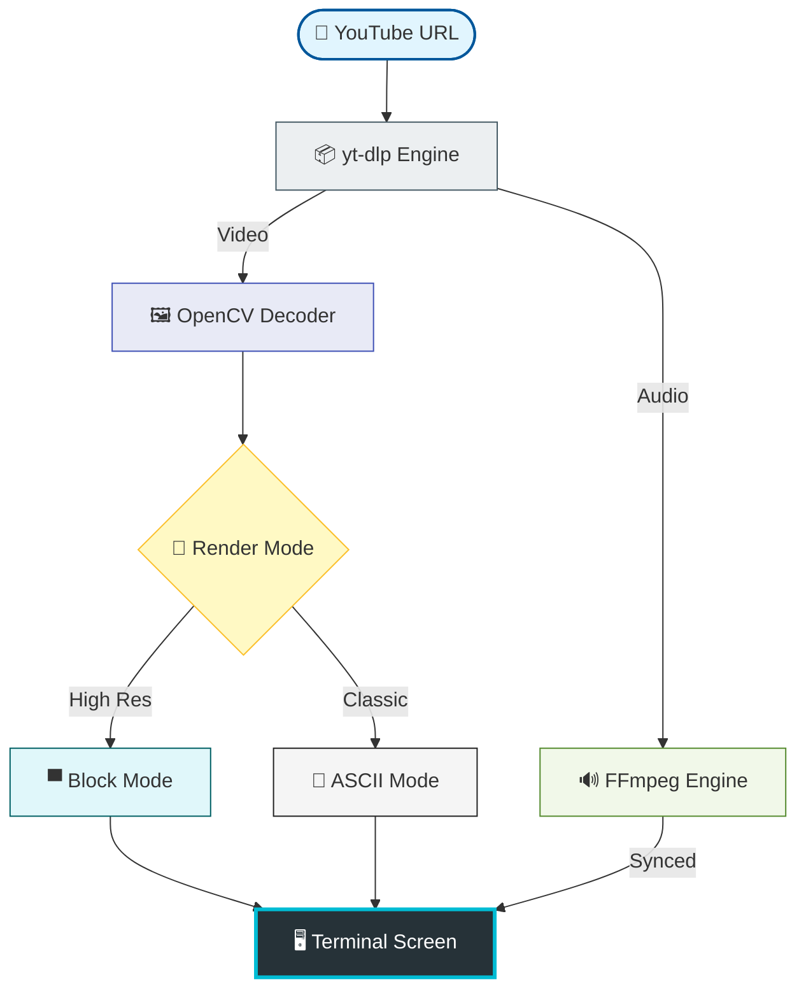

<div align="center">

# 🎬 TUBE-ASCII
### *The Ultimate Command-Line YouTube Experience*

<p align="center">
  
</p>

[](https://www.python.org/)
[](https://opensource.org/licenses/MIT)
[](https://github.com/idusha-manaka/TubeASCII/stargazers)
[](https://github.com/idusha-manaka/TubeASCII)

---

### **🚀 Transform your terminal into a cinematic powerhouse.**
*TubeASCII uses advanced rendering logic to stream high-definition video directly to your console.*

[✨ Features](#-key-features) • [🚀 Setup](#-installation) • [🎮 Controls](#-controls) • [🛠️ Architecture](#-system-architecture)

</div>

---

## ⚡ System Architecture



---

## 💎 Key Features

- 🎨 **Block Mode (`▀`)**: Utilizes half-blocks to achieve double the vertical resolution and incredible color accuracy.
- 🚀 **Stream Direct**: No disk space? No problem. Stream directly from YouTube servers to your terminal.
- 🔊 **Sonic Sync**: Perfectly aligned background audio using multi-threaded FFmpeg processing.
- ⚡ **Turbo Playback**: Adjust playback speed on-the-fly from 0.25x to 3.0x with zero lag.
- 📐 **Smart Scaling**: Automatically detects and scales video frames to fit your terminal window.

---

## 🚀 Installation & Usage

### 1️⃣ Prepare Your Gear
Ensure you have **Python 3.8+** and **Pip** installed.

### 2️⃣ Get the Code
```bash
git clone https://github.com/idusha-manaka/TubeASCII.git
cd TubeASCII
pip install -r requirements.txt
```

### 3️⃣ Audio Hardware (FFmpeg)
Download `ffmpeg.exe` and `ffplay.exe` from [this link](https://www.gyan.dev/ffmpeg/builds/ffmpeg-git-essentials.7z) and place them in the project root folder.

### 4️⃣ Ignition
```bash
python main.py
```

---

## 🎮 Battle Stations: Controls

| Command | Key | Action |
| :--- | :---: | :--- |
| **Play / Pause** | <kbd>Space</kbd> | Toggle video playback |
| **Increase Speed** | <kbd>→</kbd> | Speed up the stream (+0.25x) |
| **Decrease Speed** | <kbd>←</kbd> | Slow down the stream (-0.25x) |
| **Adjust Sync** | <kbd>[</kbd> <kbd>]</kbd> | Manually fix Audio/Video delay |
| **Abort** | <kbd>Q</kbd> | Quit the player |

---

## 🛠️ The Tech Arsenal

- **Extraction**: `yt-dlp` (The world's best video downloader/extractor)
- **Vision**: `OpenCV` (High-performance frame processing)
- **Rendering**: `Custom Python Engine` (ANSI/VT100 Color virtualization)
- **Audio**: `FFmpeg Essentials` (The industry standard for media processing)

---

## 📈 Roadmap
- [x] High-Resolution Block Mode
- [x] Dynamic Audio Synchronization
- [ ] Direct YouTube Playlist Support
- [ ] Cross-Platform Binary Support (.exe / .app)

---

<div align="center">

### 🌟 Legend Status
If you find this project cool, give it a star! It helps more developers discover the magic.

[](https://github.com/idusha-manaka/TubeASCII/stargazers)

<br>

**Crafted with 💖 by [Idusha Manaka](https://github.com/idusha-manaka)**

[](https://github.com/idusha-manaka)

<br>


</div>
