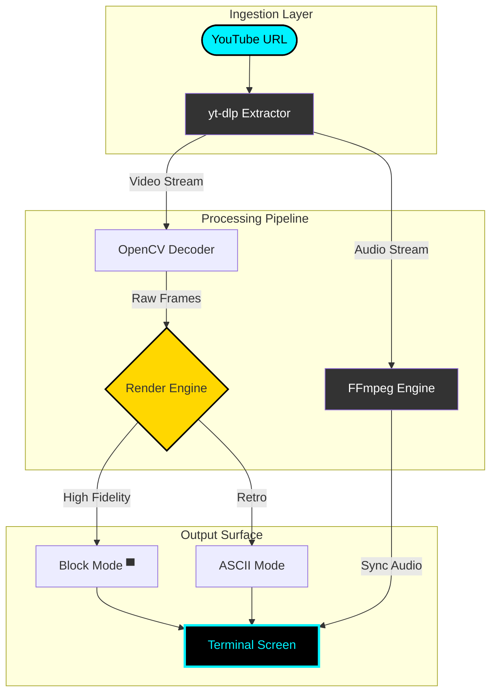

# 🎬 TUBE-ASCII PLAYER
<p align="center">
  
</p>

<p align="center">
  <a href="https://github.com/idusha-manaka/TubeASCII/stargazers"></a>
  <a href="https://www.python.org/"></a>
  <a href="https://opensource.org/licenses/MIT"></a>
  
</p>

<p align="center">
  
  
  
</p>

---

<p align="center">
  <b>Transform your command line into a high-fidelity cinematic experience.</b><br>
  <i>TubeASCII leverages advanced half-block rendering to deliver real-time, low-latency YouTube streaming directly to your terminal buffer.</i>
</p>

<p align="center">
  <a href="#-core-features"><b>Features</b></a> • 
  <a href="#-deployment-guide"><b>Deployment</b></a> • 
  <a href="#-terminal-controls"><b>Controls</b></a> • 
  <a href="#-engine-architecture"><b>Architecture</b></a>
</p>

---

## ⚡ Engine Architecture



---

## 💎 Core Features

<table align="center">
  <tr>
    <td width="33%" align="center">
      <b>🎨 Chroma Engine</b><br>
      High-accuracy 24-bit TrueColor mapping using dual-pixel half-blocks.
    </td>
    <td width="33%" align="center">
      <b>🚀 Direct Buffer</b><br>
      Real-time streaming without disk writes, ensuring zero storage footprint.
    </td>
    <td width="33%" align="center">
      <b>🔊 Sonic Sync</b><br>
      Automated A/V alignment with sub-millisecond precision controls.
    </td>
  </tr>
</table>

---

## 🚀 Deployment Guide

### 1️⃣ Environment Initialization
```bash
# Clone the repository
git clone https://github.com/idusha-manaka/TubeASCII.git
cd TubeASCII

# Install dependencies
pip install -r requirements.txt
```

### 2️⃣ Binary Requirements (FFmpeg)
TubeASCII requires the FFmpeg binaries for high-performance audio synchronization.
- **Download**: [FFmpeg Release Builds](https://github.com/BtbN/FFmpeg-Builds/releases)
- **Installation**: Place `ffmpeg.exe` and `ffplay.exe` in the root directory.

### 3️⃣ Execution
```bash
python main.py
```

---

## 🎮 Terminal Controls

| Function | Command | Keyboard |
| :--- | :--- | :---: |
| **Playback** | Toggle Play/Pause | <kbd>Space</kbd> |
| **Speed** | Increase / Decrease | <kbd>→</kbd> <kbd>←</kbd> |
| **Synchronization** | Fine-tune A/V Delay | <kbd>[</kbd> <kbd>]</kbd> |
| **Termination** | Exit Player | <kbd>Q</kbd> |

---

## 🛠️ Internal Stack

| Module | technology | Implementation |
| :--- | :--- | :--- |
| **Data Scraping** | `yt-dlp` | Dynamic stream resolution handling |
| **Video Decoding** | `OpenCV` | Real-time frame-by-frame interpolation |
| **Rendering** | `ANSI/VT100` | Custom half-block Unicode virtualization |
| **Audio Pipeline** | `Subprocess` | Low-latency ffplay background execution |

---

## 🛠️ Roadmap & Future Enhancements
- [x] High-fidelity Block Mode
- [x] Real-time Speed Control
- [ ] Direct Playlist Streaming
- [ ] Terminal Audio Visualization
- [ ] Cross-platform binary packaging

---

<div align="center">

### 🌟 Project Status & Activity
[](https://github.com/idusha-manaka/TubeASCII)
[](https://github.com/idusha-manaka/TubeASCII/issues)

<br>

**Developed with Precision by [Idusha Manaka](https://github.com/idusha-manaka)**

[](https://github.com/idusha-manaka)

<br>


</div>
